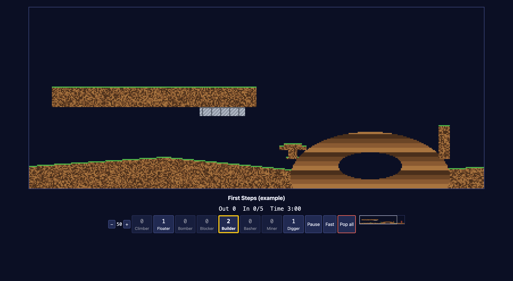
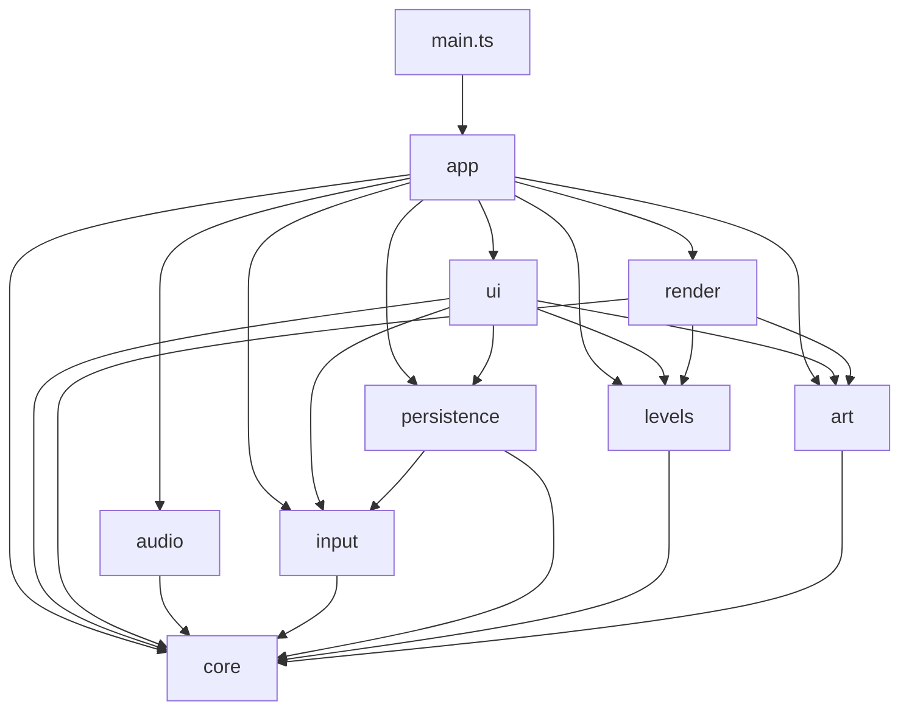
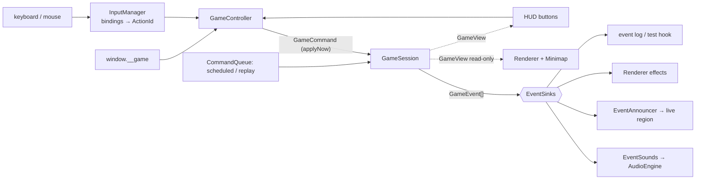

# Architecture

Phase 3 output. It covers the build system, the module layout, the data flow, the key
interfaces and the conventions. The working scaffold lives in the project root. Gameplay stubs
are marked `TODO(dev)` and design placeholders are marked `TODO(design)`.
Mechanics numbers come from [`docs/research/RESEARCH.md`](../research/RESEARCH.md) §2. The
scaffold also follows the design phase's locked decisions (`docs/design/`, D1–D10):

- The game is **Mumblemarch** and the critters are **mumbles**. Code identifiers keep
  `lemming*`, but no user-facing text may contain "Lemm-".
- The view is 400×160.
- Levels are 160 px tall.



---

## 1. Decisions at a glance

| Topic | Decision | Why |
|---|---|---|
| Language | TypeScript, **erasable syntax only** (no `enum`, `namespace` or parameter properties) | Node 22 runs the same `.ts` files directly for tests. The `erasableSyntaxOnly` flag enforces this. |
| Bundler / dev server | **esbuild 0.28** (JS API in `scripts/`) | One small binary with no transitive deps. It gives bundling, watch mode, an in-memory dev server and live reload with no custom server code. `dist/` is one JS and one CSS file. |
| Type-checking | **TypeScript 7.0.2** (`tsc`, the native Go port), `--noEmit` only | esbuild emits and `tsc` only checks. That is TS 7's most robust path, and checking is fast. Verified working with every flag below. |
| Tests | **`node --test`** on `.ts` files (Node ≥ 22.18 strips types natively, no flag) | Zero test dependencies, no build step, and it runs the real `src/` modules. |
| Runtime deps | **None** | Hard constraint. Dev deps: `typescript`, `esbuild`, `@types/node` (types for tests only). |
| Architecture guard | `scripts/check-architecture.mjs` + `tsconfig.core.json` | `npm run check` enforces these rules mechanically, not by discipline: layer import rules, no `any`, `.ts` specifiers, a DOM-free and Node-free core, and no `Math.random`/`Date`/timers in `core/` or `levels/`. |
| Simulation | Fixed **17 ticks/s**, integer pixels, seeded RNG, command queue | Deterministic and replayable. This matches the original (RESEARCH §2.1). |
| Rendering | Canvas 2D at world resolution (400×160 view, DESIGN D2), CSS integer upscaling ×2–×4, `image-rendering: pixelated` | Pixel-perfect and cheap. Terrain re-uploads only the dirty rectangle. |
| UI | Real DOM (`<button>`, `<dialog>`, headings) around the canvas | Accessibility for free: focus, keyboard, and screen readers. |
| Styling | Plain CSS with custom-property tokens (`src/styles/tokens.css`), bundled by esbuild `@import` | No preprocessor. |

Candidate A (tsc emitting ES modules plus a hand-written static server) was rejected. It needs a
server with MIME types, watch and live reload that we would have to maintain. It also depends
on TS 7's emit path and ships ~40 unbundled files. esbuild removes all of that for one
well-known dev dependency.

## 2. Commands

| Command | What it does |
|---|---|
| `npm install` | Installs the 3 dev dependencies. |
| `npm run dev` | esbuild watch + dev server on **http://localhost:5180** (bound to 127.0.0.1). Bundles are served from memory, nothing is written. `index.html` is served from the project root. The page auto-reloads on every rebuild. Edits to `index.html` itself need a manual refresh. |
| `npm run build` | Clean production build into `dist/` (`index.html`, `main.js`, `main.css` + source maps). All URLs are relative, so it works from any static host or sub-path. |
| `npm run preview` | Serves `dist/` on **http://localhost:5181**, to test the production build. |
| `npm run typecheck` | `tsc` three times: app (DOM), core purity (no DOM, no Node), tests (Node). |
| `npm run lint` | Architecture guard: layer imports, no `any`, `.ts` import specifiers, deterministic core. |
| `npm test` | `node --test "tests/**/*.test.ts"`. |
| `npm run check` | typecheck + lint + test. **Run it before handing work over.** |
| `npm run snapshot` | `node scripts/snapshot.mjs <port>` — one-off production build + static serve (no live reload), for isolated browser checks while others edit. `scripts/port-art.mjs` regenerates `src/art/*` and `src/levels/theme-data.ts` from `docs/design/mockups/sprites.js`. |

Background-agent note: `npm run dev` and `npm run preview` are long-running. Start them in the
background and stop them with `pkill -f scripts/dev.mjs` or `pkill -f scripts/preview.mjs`.
Stopping the dev server while a page is open logs **one** network error in that page, because
the live-reload stream is cut; the stream then closes. Check console errors only while the
server is running.

## 3. Folder layout

```
index.html              semantic shell: <main>, #stage canvas, #screen-root, 2 live regions
package.json            scripts + 3 dev deps, "type": "module"
tsconfig.json           app config (src/**, DOM) — strict, noEmit
tsconfig.core.json      purity guard for src/core + src/levels (lib ES2023 only)
tests/tsconfig.json     tests (Node types, no DOM)
scripts/                esbuild.config.mjs · dev.mjs · build.mjs · preview.mjs · check-architecture.mjs
src/
  main.ts               entry: live-reload hook (dev only) + startApp(document)
  env.d.ts              declare const __DEV__
  core/                 PURE deterministic simulation (no DOM, no Node, no Math.random)
    types.ts            domain types: SkillId, LemmingState, Lemming, CompiledLevel,
                        GameCommand, GameEvent, GameView, GameSnapshot, EventSink…
    constants.ts        every physics number (from RESEARCH §2)
    rng.ts              mulberry32 + hashString
    terrain.ts          Terrain (material + colour bytes, dirty rect), Material
    commands.ts         CommandQueue (tick-stamped, records history → Replay)
    session.ts          GameSession: step(), applyNow(), enqueue(), snapshot(), replay()
    picking.ts          pickLemmingAt / cycleLemming (shared by mouse, keyboard and tests)
    headless.ts         runHeadless(level, {commands, maxTicks}) for tests and replays
    behaviours/         one file per behaviour family + registries
      context.ts        TickContext, StateHandler, SkillRule, setState
      index.ts          STATE_HANDLERS: Record<LemmingState,…>, SKILL_RULES: Record<SkillId,…>
      movement.ts       shared ground/wall helpers
      walk · fall · climb · block · build · bash · mine · dig · bomb · terminal .ts
  levels/               level data + compiler (pure)
    format.ts           LevelDef authoring format
    compiler.ts         validateLevel(), compileLevel() → CompiledLevel
    themes.ts           indexed palettes + colour roles
    stamps.ts           ASCII-art terrain shapes
    registry.ts         LEVELS (campaign order), TIERS, getLevel, nextLevel
    data/*.ts           one file per level
  art/                  pure sprite/anim DATA (no DOM), ported from docs/design/mockups/sprites.js
    anim.ts (PixelFrame, Anim, animFrameIndex) · palette.ts · mumble.ts · objects.ts · icons.ts
    overlays.ts · types.ts · index.ts — palette/mumble/objects/icons/overlays are GENERATED
  render/               Canvas 2D (reads GameView, never mutates)
    renderer.ts · terrain-layer.ts · sprites.ts · camera.ts · minimap.ts · cursor.ts
  audio/                Web Audio synthesis
    audio-engine.ts · sfx.ts · music.ts · event-sounds.ts
  input/                ONE place for keys/mouse
    actions.ts · bindings.ts · input-manager.ts
  ui/                   DOM screens, HUD, accessibility services
    dom.ts (h() helper) · strings.ts · announcer.ts · event-announcements.ts · focus.ts · dialog.ts
    screens/ screen.ts (Route, Screen, ScreenContext) · title · level-select · briefing
             · game (HUD view) · results · help · settings
    hud/     skill-bar.ts · status-bar.ts
  app/                  composition root
    app.ts (bootstrap) · router.ts · screens.ts (Route → Screen) · game-controller.ts
    game-loop.ts · services.ts · config.ts · test-hook.ts
  persistence/          schema.ts (versioned SaveData, Settings) · storage.ts (SaveStore)
  styles/               tokens.css · base.css · layout.css · hud.css · main.css (entry)
tests/                  *.test.ts (node:test) + helpers.ts
```

## 4. Layers and dependency rules



- `core/` imports nothing outside itself. `levels/` and `art/` import only `core/`. All three
  compile without DOM or Node types (`tsconfig.core.json`).
- `ui/` never imports `app/`. It receives a `ScreenContext` (dependency inversion).
  `app/` is the only layer that knows everything, and it composes the others.
- Rules are enforced by `scripts/check-architecture.mjs` (the `ALLOWED` table). Changing a
  rule is an architecture decision: update the table **and** this section.

## 5. Data flow



1. **Input.** Raw DOM events become an `ActionId` in `InputManager`, which uses the single
   `bindings.ts` table. HUD buttons call the same controller methods.
2. **Commands.** Anything that changes the simulation is a `GameCommand`: `assign-skill`,
   `set-release-rate`, `adjust-release-rate`, or `nuke`.
   - Player and test-hook commands go through `session.applyNow()`. It works while paused
     (DESIGN D7) and returns its events straight away, so the player gets instant feedback.
   - `applyNow` is recorded at the current tick, which makes it exactly equivalent to a
     command queued for the next `step()`. Replays stay exact.
   - `enqueue(cmd, tick)` schedules commands, for replays and headless tests.
   - Pause, fast-forward, restart and the camera are app concerns and are *not* commands.
3. **Loop.** Each animation frame, `GameLoop` calls `frame(elapsedMs)`, then runs `tick()` for
   every `TICK_MS` of speed-scaled real time, then calls `render()`.
   - `frame` runs even while paused. It handles real-time app logic: held keys, scrolling and
     the keyboard cursor.
   - Each tick calls `session.step()`. A step applies due commands, then spawns, then updates
     each lemming in release order (fuse → `stateTicks++` → state handler → triggers), then
     runs the nuke, traps, the clock and the end check. It returns the tick's `GameEvent[]`.
4. **Events → sinks.** The controller passes each tick's events to every `EventSink`, even when
   the list is empty, so time-based batching can flush. The core never calls audio, the DOM
   or the renderer.
5. **Render.** Once per animation frame, the renderer, minimap and HUD *read* the session
   through `GameView`, a live read-only interface with no allocations. `GameSnapshot` is the
   JSON copy used by tests and the hook.

## 6. Core simulation

- **Determinism.** Integer pixel maths, `createRng(seed)` as the only randomness, no clocks,
  and stable iteration (lemmings update in release order). Given `(CompiledLevel, seed,
  relaxedTimer, TimedCommand[])`, the result is identical everywhere, and `session.replay()`
  returns exactly that. The compiler uses `d*d` rather than `**`, because float `pow` may
  differ between engines.
- **Coordinates.** A lemming's `(x, y)` is its **foot pixel**, and it is supported when
  `terrain.isSolid(x, y)`.
  - Exit anchors in levels use the same convention (the floor pixel under the doorway), and
    `EXIT_TRIGGER` includes that row.
  - Triggers (exit, water, traps) test only the foot pixel.
  - Level edges act as walls: use `movement.isSolidOrEdge`.
- **Terrain.** Two `Uint8Array`s of `width × height`: `material` (`Material.Empty | Earth |
  Steel | OneWayLeft | OneWayRight`) and `color` (theme palette index, 0 = transparent).
  - `remove(x, y, dir)` refuses steel, and refuses one-way earth against its arrow. Pass
    `dir = 0` for diggers and bombs, which ignore one-way walls.
  - Every write grows a dirty rect, which the renderer takes each frame.
  - A session `clone()`s the compiled terrain, so restart means making a new session.
- **Lemming state machine.** There is exactly one `state` (18 states in `LEMMING_STATES`,
  including `jumping`). Permanent flags (`isClimber`, `isFloater`) and `fuseTicks` are
  separate from it.
  - `stateTicks` drives timed transitions and the animation frame.
  - The session increments `stateTicks` **before** each handler call, so the first tick in any
    state sees `1`, however the state was entered.
  - Always change state through `setState()`, which resets `stateTicks` to 0.

  ```mermaid
  stateDiagram-v2
    [*] --> falling: spawn
    falling --> walking: land
    falling --> floating: floater
    floating --> walking: land
    falling --> splatting: fall counter > 60
    walking --> falling: no floor
    walking --> climbing: wall + climber
    climbing --> hoisting: top
    hoisting --> walking
    walking --> working: skill
    working --> walking: done / steel
    working --> shrugging: builder out of bricks
    shrugging --> walking
    walking --> exiting: exit trigger
    walking --> drowning: water
    walking --> burning: fire
    ohno --> exploding: OHNO_TICKS
    note right of working: blocking, building, bashing, mining, digging
    note left of ohno: entered from any state when the fuse reaches 0
  ```
- **Behaviours.** A `StateHandler` is `(lem, ctx: TickContext) => void`. A `SkillRule` is
  `{ rejectReason(lem, ctx): SkillRejectReason | null, assign(lem, ctx) }`.
  - `SkillRejectReason` is one of `not-applicable`, `steel`, `one-way`, `blocker-overlap` or
    `too-high`. It drives the refusal "ting" and the spoken explanation.
  - `TickContext` exposes the level, terrain, rng, `lemmings`, `nuking` and `emit`. It also has
    `blockerTurn(x, y, selfId)`, which returns −1, +1 or 0 depending on the field column, and
    `kill` / `save`.
  - `UNASSIGNABLE_STATES` (dying or exiting) and `AIRBORNE_STATES` encode RESEARCH §2.5.
  - Both registries are `Record<…>`, so adding a state or skill to the union fails
    type-checking until it is registered.
  - Behaviours report facts through `ctx.emit` and resolve lemmings with
    `ctx.kill(lem, cause)` or `ctx.save(lem)`. Counters live only in the session.
  - The session does the generic assignment checks: count > 0, then `rejectReason`. It
    decrements the count and emits `skill-assigned` or `skill-rejected{reason}`. A refused
    skill is never consumed.
  - Trap state is exposed as `hazardCooldowns` on `GameView`/`GameSnapshot`, one entry per
    `level.hazards` index.
- **Events.** `GameEvent` is a small discriminated union of JSON-safe facts: `lets-go`,
  `entrance-opened`, `lemming-spawned`, `skill-assigned`, `skill-rejected{reason}`,
  `lemming-ohno{nuking}`, `explosion`, `builder-low-bricks`, `builder-finished`, `hit-steel`,
  `trap-triggered`, `lemming-exited`, `lemming-died{cause}`, `release-rate-changed`,
  `all-released`, `nuke-started`, `time-low`, and `level-ended{outcome}` (win and lose are one
  event with `outcome.won`). New event types are added to the union, and the `switch`es in
  `event-sounds.ts` then fail to compile until they handle them.

## 7. Key interfaces

| Interface | File | Role |
|---|---|---|
| `SkillId`, `SKILL_IDS`, `LemmingState`, `LEMMING_STATES` | `core/types.ts` | Skill-bar order and state names (const arrays → unions) |
| `Lemming` | `core/types.ts` | Mutable simulation record (core-owned) |
| `CompiledLevel`, `HazardZone` | `core/types.ts` | Simulation-ready level (compiler output) |
| `GameCommand`, `TimedCommand`, `Replay` | `core/types.ts` | Everything the player can do to the sim |
| `GameEvent`, `EventSink` | `core/types.ts` | Everything the sim reports, and its consumers |
| `GameView`, `GameSnapshot`, `GameCounts`, `LevelOutcome` | `core/types.ts` | Read-only live view and JSON copy |
| `Terrain`, `ReadonlyTerrain`, `Material` | `core/terrain.ts` | Destructible bitmap |
| `TickContext`, `StateHandler`, `SkillRule` | `core/behaviours/context.ts` | Behaviour contract |
| `GameSession`, `SessionOptions` | `core/session.ts` | `step()`, `applyNow()`, `enqueue()`, `snapshot()`, `replay()`; options `seed`, `relaxedTimer` |
| `pickLemmingAt`, `lemmingsAt`, `cycleLemming` | `core/picking.ts` | Mouse and keyboard selection (shared rules) |
| `LevelDef`, `TerrainPrimitive`, `HazardDef` | `levels/format.ts` | Authoring format |
| `Theme` | `levels/themes.ts` | Palette + colour roles |
| `RenderState` | `render/renderer.ts` | What the renderer needs per frame |
| `ActionId`, `KeyBindings` | `input/actions.ts`, `input/bindings.ts` | Logical actions + the one key table |
| `InputHandler` | `input/input-manager.ts` | `onAction`, `onPointerMove`, `onPointerDown` |
| `Route`, `Screen`, `ScreenContext` | `ui/screens/screen.ts` | Navigation + the screen contract |
| `Settings`, `SaveData` | `persistence/schema.ts` | Versioned persisted data |
| `LoopCallbacks`, `FrameScheduler` | `app/game-loop.ts` | `tick` / `frame(elapsedMs)` / `render`; injectable scheduler |
| `AppServices`, `GameTestHook`, `ControllerState` | `app/services.ts`, `app/test-hook.ts`, `app/game-controller.ts` | Composition + automation API |

## 8. Level authoring format

Levels are plain typed objects (`LevelDef`), one file per level in `src/levels/data/`,
registered in campaign order in `registry.ts`. There is no parser and no fetch; the type
checker validates the shape, and `validateLevel()` checks the semantics:

- height is 160
- width is 400–1600 in steps of 8
- at most 80 lemmings
- 1–4 entrances
- skill counts of 0–99
- hazards inside the level

Tests also check that every registered level puts its exits on solid floor and its entrances
in open air. Terrain primitives
are painted **in order**. Each primitive can set these options:

- `op`: `add` (default), `behind` (paint only where empty), or `erase` (carve).
- `material`: `earth`, `steel`, `one-way-left`, or `one-way-right`.
- `fill`: `natural` (textured, with a lit top surface), `solid`, `strata`, `bricks`, or
  `metal` (the default for steel).

Colours come from the theme palette, and noise uses the level's seeded RNG, so compiling the
same level always gives byte-identical terrain.

```ts
export const exampleLevel: LevelDef = {
  id: 'example-first-steps', title: 'First Steps (example)', tier: 1, theme: 'mossgrove',
  hint: 'A single digger opens the way down.',
  width: 480, height: 160,              // width 400–1600 (×8), height always 160
  lemmings: 10, saveRequired: 5, releaseRate: 50, timeLimitSeconds: 180,
  skills: { digger: 1, builder: 2, floater: 1 },   // omitted skills = 0
  entrances: [{ x: 60, y: 30 }],        // spawn points (fallers facing right)
  exits: [{ x: 400, y: 141 }],          // floor pixel under the doorway centre
  terrain: [
    { kind: 'rect', x: 20, y: 70, w: 180, h: 18 },
    { kind: 'polygon', points: [[0, 160], [0, 140], [120, 132], [260, 146], [480, 138], [480, 160]] },
    { kind: 'ellipse', cx: 300, cy: 150, rx: 70, ry: 40, fill: 'strata' },
    { kind: 'ellipse', cx: 300, cy: 140, rx: 28, ry: 12, op: 'erase' },
    { kind: 'rect', x: 150, y: 88, w: 40, h: 8, material: 'steel' },
    { kind: 'rect', x: 440, y: 100, w: 16, h: 40, fill: 'bricks' },
    { kind: 'stamp', stamp: 'mushroom', x: 220, y: 120, scale: 2, op: 'behind' },
    { kind: 'rect', x: 360, y: 104, w: 10, h: 30, material: 'one-way-right' },
  ],
  hazards: [{ kind: 'water', x: 200, y: 150, w: 40, h: 10 }],   // water | fire | trap
};
```

`compileLevel(def)` returns a `CompiledLevel` with these fields:

- `terrain`
- `entrances` and `exits`
- `hazards`, each with an `area` and `cooldownTicks`
- the counts and skills
- `timeLimitTicks`
- `seed` (defaults to a hash of the id)
- `brickColor` and `themeId`

Keep coordinates on a 4 px grid for steel and triggers, as the original did.

## 9. Rendering

- The `#game-canvas` backing store is exactly the view (`VIEW_WIDTH × VIEW_HEIGHT` = 400×160
  world px). `app.ts` sets its CSS size to the largest integer multiple that fits the stage:
  between `MIN_SCALE` 2 and `MAX_SCALE` 4, or the `Settings.scale` override.
  `image-rendering: pixelated` keeps the pixels crisp.
- `TerrainLayer` keeps an offscreen canvas of the whole level. Each frame it re-colours only
  `terrain.takeDirty()`, using a palette LUT (`Uint32Array`), and calls `putImageData` for
  that rectangle. The frame blits the camera window, then draws objects, lemmings, the
  selection marker and effects.
- Sprites are ASCII pixel rows in `sprites.ts` (one char per pixel, colour map
  `SPRITE_COLORS`). `SpriteAtlas` pre-renders each frame and caches a mirrored copy. The
  animation frame is `stateTicks % frames`.
- `Camera` and `Minimap` are separate small classes. The renderer is an `EventSink`, for
  particles and flashes. Flashes and ambient animation are skipped when
  `RenderState.reducedMotion` is set.

## 10. Audio

- `AudioEngine` creates the `AudioContext` lazily in `unlock()`. The app calls `unlock()` on
  user-activation gestures (`pointerdown`, or a `keydown` other than Escape) until the
  context is running, so **nothing can play before a gesture**.
- The graph is `master → (sfx, voice, music)`, with volumes and mute taken from `Settings`
  and applied with short ramps to avoid clicks.
  - Critter chirps (`VOICE_SFX`) go to the voice bus.
  - `play(id, pitch)` varies pitch per critter.
- Each effect triggers at most once per 60 ms, so a crowd exiting doesn't stack into a roar.
- During a nuke, `lemming-ohno{nuking:true}` is silent and a single nuke sound plays.
- `sfx.ts` holds the synth recipes, and `event-sounds.ts` maps `GameEvent → SfxId`.
- `music.ts` is an optional procedural sequencer (a stub for now). Music must be original.

## 11. Input and keyboard-only play

- `bindings.ts` is the **only** table of keys. It maps `ActionId` to `KeyboardEvent.code[]`
  (layout-independent). User overrides are stored in `Settings.bindings` and merged over the
  defaults by `resolveBindings()`. A key the player rebinds is removed from every other
  action, so the rebinding always wins.
- `InputManager` ignores keys in these cases:
  - Ctrl, Meta or Alt is held (browser shortcuts).
  - Focus is in a text field or inside a `<dialog>`.
  - The focused control owns the key (`ownsKey`). Space and Enter belong to any control;
    arrow keys belong to sliders, selects and widgets marked `data-arrow-keys`.
  - HUD buttons `preventDefault` on `mousedown`, so a mouse click never parks focus there
    and steals Space.

  OS auto-repeat is suppressed, and window blur releases every held key. Actions arrive as
  `down` and `up`. The controller's `frame(elapsedMs)` implements hold-to-repeat for
  `HOLDABLE_ACTIONS`: release rate (one step per 60 ms), camera scroll, and the keyboard
  cursor.
- Keyboard lemming selection uses `lemming-next` / `lemming-prev`, which call `cycleLemming`:
  selectable mumbles, left→right, wrapping, continuing from the last position if the
  selected mumble is gone. It centres the camera and announces the selection ("Athlete
  selected").
- `assign` gives the chosen skill to the selected mumble, or to the one under the cursor.
  `cursor-*` moves a keyboard crosshair (edge-scrolling is TODO(dev)).
- `frame-step` advances one tick while paused, and `mute` toggles sound.
- The mouse path uses the same `pickLemmingAt`/`lemmingsAt`. The status line shows
  `describeLemming()` and the count under the cursor ("Walker 3").
- Tab and Shift+Tab stay reserved for focus navigation.

## 12. UI, screens and accessibility

- The shell is `index.html`. The router mounts one `Screen` at a time into `#screen-root`.
  The canvas stage persists and is shown only for screens with `usesStage`.
- The router handles each navigation the same way:
  1. It destroys the old screen and mounts the new one.
  2. It sets `document.title`.
  3. It focuses the screen's `<h1>`, or the screen's `focusTarget`, in which case the screen
     title is announced.
- `Route` is a discriminated union, so navigation is type-checked.
- Screens are small functions `(ctx: ScreenContext, …) → Screen`. They build DOM with `h()`,
  a 20-line helper; there is no framework. All copy lives in `ui/strings.ts`.
- The HUD is made of real buttons:
  - `SkillBar` sets `aria-pressed` for the selected skill, `aria-keyshortcuts`, and an
    `aria-label` such as "Digger, 1 left". Empty skills get `aria-disabled` and stay
    focusable.
  - `update()` only writes the DOM when a value changes.
  - The selected state is shown by border and weight, not colour alone.
- `StatusBar` is plain text and deliberately **not** a live region.
- Announcements go through a single `Announcer`, the only code that writes to the two ARIA
  live regions. `EventAnnouncer` batches saves and deaths into one summary every 2 s. It
  respects the `Settings.announcements` level (`off` / `essential` / `all`).
- Dialogs use the native `<dialog>` in `ui/dialog.ts`. `choiceDialog()` covers the pause menu
  (Escape: Resume / Restart / Help / Quit) and `confirmDialog()` covers the nuke ("Pop all").
  The native element provides a focus trap, closes on Escape, and returns focus to the
  invoker. The game pauses while a dialog is open.
- The `Announcer` joins messages said within 50 ms ("Digger, 1 left. 30 seconds left")
  instead of dropping them. The controller announces skill choice, selection,
  pause/resume and refusals with their reason.
- Motion: `data-motion="reduce|full"` on `<html>` comes from settings plus
  `prefers-reduced-motion`. CSS durations are zeroed through tokens, and the renderer gets
  `reducedMotion`.
- The game auto-pauses when the tab is hidden, and pause is available at any time (P or the
  button).

## 13. Persistence

- `SaveData { version: 1, settings, progress }` is stored under
  `localStorage['mumblemarch.save']`. Never rename the key once shipped.
- `Settings` covers:
  - the master, sfx, voice and music volumes
  - `muted`
  - `musicEnabled`
  - `motion`
  - `announcements`
  - `highContrast` (sets `data-contrast` on `<html>`)
  - `relaxedTimer` (passed to `SessionOptions`)
  - `scale`
  - `bindings` overrides, sanitised on load
- `loadSave()` never throws. Missing, full, disabled or corrupt storage falls back to
  defaults field by field.
- `SaveStore` holds the data in memory. It persists on every change and notifies
  subscribers; `app.ts` re-applies volumes, bindings and motion.
- Schema changes bump `SAVE_VERSION` and add a step in `migrate()`. Never drop players'
  progress.

## 14. Test and automation hook: `window.__game`

It is installed in dev and prod builds (`app/test-hook.ts`). All return values are plain
JSON, so they work with chrome-devtools `evaluate_script`.

| Method | Purpose |
|---|---|
| `screen()` / `navigate(route)` | Current `ScreenId` / go anywhere (e.g. `{screen:'help', back:{screen:'title'}}`) |
| `levels()` | `[{id, title, tier}]` |
| `loadLevel(id, {autoAdvance?})` | Open the game screen **with real time paused** and auto-advance to results **off** (the test owns the clock); return the initial `GameSnapshot` |
| `step(n = 1)` | Run `n` ticks synchronously (same code path as real time, so sinks fire) → snapshot |
| `snapshot()` | Current `GameSnapshot` or `null` |
| `ui()` | `{selectedSkill, selectedLemmingId, hoveredLemmingId, cursor, paused, speed, cameraX}`, for keyboard-play tests |
| `assignSkill(id, skill)` / `setReleaseRate(r)` / `nuke()` | Apply a command **now**, like a player (works while paused; nuke skips the dialog). Results appear in `snapshot()` and `events()` |
| `setRealtime(bool)` | Resume or pause the real-time loop |
| `events(limit?)` | Recent `{tick, event}` records (ring buffer of 500) |
| `terrainAt(x, y)` | `'Empty' | 'Earth' | 'Steel' | 'OneWayLeft' | 'OneWayRight'` |

Typical e2e script: `__game.loadLevel('…')` → `__game.step(60)` → read `snapshot().lemmings`
→ `__game.assignSkill(0, 'digger')` → `__game.step(200)` → assert on `snapshot()` or
`events()`, then take a screenshot. Always open your **own** page (`new_page`) and check
`list_console_messages` for zero errors.

## 15. Testing strategy

- **Unit (Node, `tests/*.test.ts`)** covers the core, the levels, persistence and the loop
  (`GameLoop` takes an injected `FrameScheduler`).
  - Build tiny levels with `tests/helpers.ts` (`levelDef()`, `compiled()`), step a
    `GameSession` or use `runHeadless()`, and assert on snapshots and events.
  - `tests/behaviours.todo.test.ts` lists the behaviour specs still to write, as `test.todo`.
    The dev phase turns each one into a real test.
  - Keep physics tests exact: pixel positions after N ticks, with the numbers from
    RESEARCH §2.
- **Determinism** tests run the same replay twice and compare snapshots.
- **Level lint** is already a test. It checks that every registered level validates and
  compiles, that ids are unique, and that exits sit on floor and entrances in air.
- **E2E (browser)** uses chrome-devtools MCP against `npm run dev` or `npm run preview`,
  driving through `window.__game`, keyboard (`press_key`) and clicks, plus the a11y tree
  (`take_snapshot`) and screenshots. The check for zero console errors is mandatory.

## 16. Conventions

- **Files and names:**
  - Files are `kebab-case.ts`, one concept per file, ideally under 200 lines.
  - Types and classes are `PascalCase`, functions and variables `camelCase`, constants
    `UPPER_SNAKE`.
  - Unions come from `as const` arrays (`SKILL_IDS` → `SkillId`).
- **TypeScript (`tsconfig.json`):**
  - `strict`, `noUncheckedIndexedAccess`, `exactOptionalPropertyTypes`,
    `noPropertyAccessFromIndexSignature`, `noImplicitOverride`, `noUnused*`,
    `verbatimModuleSyntax`, `erasableSyntaxOnly`.
  - No `any` (use `unknown` and narrow). Use `import type` for types.
  - **Relative imports end in `.ts`.**
  - No enums: use `const` objects (`Material`).
- **Purity:**
  - No `Math.random`, `Date` or `performance` in `core/` or `levels/`.
  - DOM access only in `render/`, `audio/`, `input/`, `ui/` and `app/`.
- **Comments:**
  - Each file opens with a short header saying what it owns.
  - Stubs are marked `TODO(dev)` and placeholders `TODO(design)`.
  - Mechanics comments cite RESEARCH section numbers.
- **CSS:**
  - Only `var(--token)` values from `tokens.css`, with no raw colours in components (canvas
    palettes live in `themes.ts` and `sprites.ts`).
  - Flat BEM-ish class names (`.skill__count`).
  - State goes in ARIA attributes (`[aria-pressed='true']`), not extra classes.
  - `[hidden]` always wins.
- **Accessibility:**
  - Every control is a native element with a visible `:focus-visible` ring.
  - Never use colour-only cues.
  - Every new event that matters to a blind player gets a line in `EventAnnouncer`.
- **Performance:**
  - No allocation per lemming per tick in hot paths (mutate in place).
  - Renderer and HUD read `GameView`; never `snapshot()` per frame.
  - Terrain uploads are dirty-rect only.
  - Cap ticks per frame (`MAX_TICKS_PER_FRAME`).
  - Don't touch the DOM when values are unchanged (`setText`).

## 17. How to extend

- **New skill or state:**
  1. Add it to `SKILL_IDS` / `LEMMING_STATES` in `core/types.ts`. Type-checking then lists
     every place to update.
  2. Write the handler and rule in `core/behaviours/<name>.ts` and register it in
     `behaviours/index.ts`.
  3. Add its name and description in `ui/strings.ts`, a key in `input/actions.ts` and
     `bindings.ts`, sprite frames in `render/sprites.ts`, and a sound mapping.
  4. Add tests.
- **New level:**
  1. Create `src/levels/data/<id>.ts` exporting a `LevelDef`.
  2. Append it to `LEVELS` in `registry.ts` (order = campaign order).
  3. `npm test` validates it.
  4. Play it with `__game.loadLevel('<id>')`.
- **New terrain shape:** add ASCII rows to `STAMPS` in `levels/stamps.ts`. For a new
  primitive kind, extend `TerrainPrimitive` and `shapeOf()` in the compiler.
- **New theme:** add a `Theme` to `THEMES` in `levels/themes.ts`. Keep terrain vs
  background contrast at 3:1 or more.
- **New screen:**
  1. Add a variant to `Route`.
  2. Write `ui/screens/<name>.ts` returning a `Screen`.
  3. Add a `case` in `app/screens.ts`; the switch is exhaustive.
- **New sound:** add the id to `SFX_IDS`, a recipe in `SFX`, and a mapping in
  `event-sounds.ts`.
- **New setting:**
  1. Add the field to `Settings` and `DEFAULT_SETTINGS`.
  2. Sanitize it in `storage.ts`.
  3. Apply it in `app.ts` `applySettings`.
  4. Add a control in `ui/screens/settings.ts`.
- **New event:** add it to the `GameEvent` union, handle it in `event-sounds.ts` (the
  compiler forces this), and consider `EventAnnouncer` and the renderer.

## 18. What the development phase implements (pointers)

- **`core/session.ts`:**
  - `releaseLemmings` (start timeline, `ENTRANCE_ORDER`)
  - `advanceNuke`
  - `checkTriggers` (exits, water, fire, traps with cooldown state, out of bounds)
  - `checkEnd`
  - `blockerTurn`
  - the TODO skill rules' `rejectReason`
- **`core/behaviours/*`:** all `TODO(dev)` handlers and rules (RESEARCH §2.3–2.5,
  §2.8–2.9: fix the listed quirks, don't copy them).
- **`core/picking.ts`:** the original overlap priority.
- **Render:**
  - entrances, exits and hazards
  - full sprite sets
  - selection marker and crosshair
  - fuse digits
  - particles
  - minimap lemming dots
- **Input:**
  - keyboard-cursor clamping and edge-scroll
  - right-click walkers-only
  - roving tabindex in the skill toolbar
  - pointer-hold on the HUD −/+
- **UI:**
  - help as an overlay that keeps the game alive
  - level locking
  - settings for motion, announcements, contrast, relaxed timer, rebinding and scale
  - DESIGN styling and copy, and a "press twice" nuke if DESIGN keeps D8
- **Audio:** real SFX recipes and original procedural music.
- **Design** (from `docs/design/DESIGN.md`): final title, tokens, palettes, themes and the
  8+ levels.
