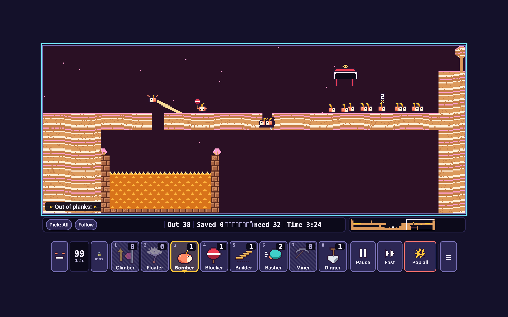
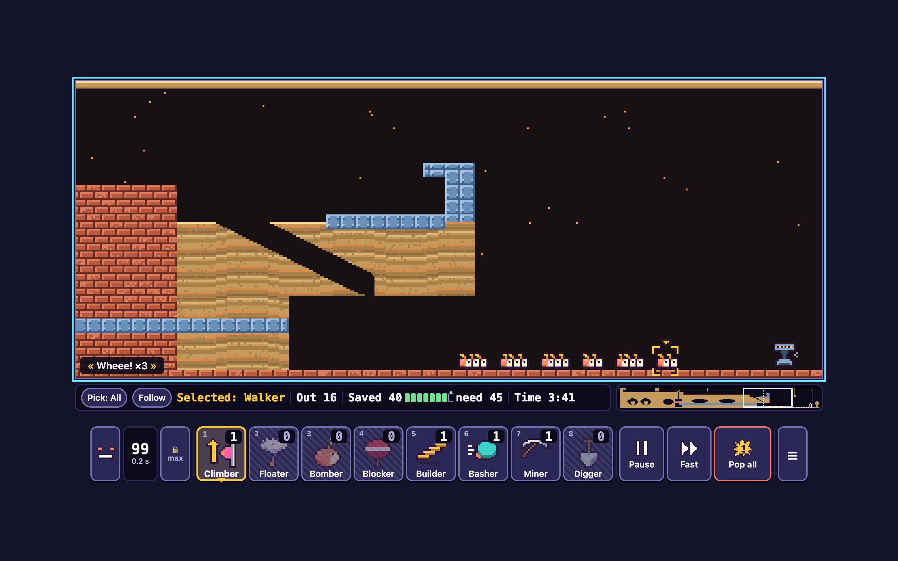
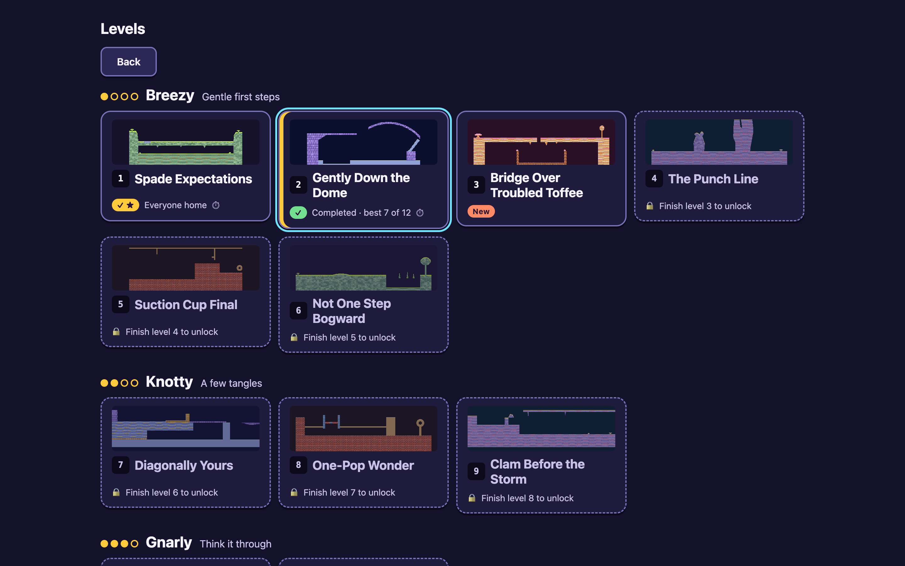

# Mumblemarch — representative screenshots

Captured against the production build (`npm run build` + `npm run preview`, served at `http://localhost:5181/`) at a 1440×900 viewport, 2026-09-26 (retaken after the VIS-6/VIS-7 layout polish: level-select cards now use a 72 px contain-fit thumbnail, and the game block is vertically centred in spare height). Staged with `window.__game` (raised release rate, `step`, `assignSkill`, `playSolution`, `setRealtime`) and real keyboard/pointer events per `docs/testing/tester-brief.md`; no dialogs, debug overlays or devtools are visible, and `list_console_messages` showed 0 errors/warnings for every shot.

**01-gameplay-crowd.png** — *Double Boiler* (sugarworks, tier 3 Gnarly), release rate raised to 99. A builder's finished staircase spans the toffee gap, a digger is mid-hole in the dock floor, a blocker holds the queue, and a bomber counts down ("2") among the waiting walkers — four skills in progress at once. Staged paused, then captured with `setRealtime(true)` so there is no "Paused" pill; full HUD (skill counts, release rate, status line, minimap) is visible throughout.

**02-foundry-gameplay.png** — *Last Shift at the Foundry* (foundry, tier 4 Stampede), driven with `playSolution` to a late moment (40 of 60 already saved) where only a handful of stragglers remain, spaced out instead of bunched. This makes the steel parapet (cross-hatched blue plating, upper left), the piston-hammer trap's floor and the exit doorway (right) all individually readable, rather than buried under an unbroken crowd. A mumble is selected with the keyboard (`X`), shown by the yellow selection bracket and the "Selected: Walker" status-line label. Captured unpaused (`setRealtime(true)`), so no pause pill shows.

**03-flow.png** — Level select screen after completing the first two Breezy levels via `playSolution`, now with the taller VIS-6 thumbnails clearly showing each level's terrain art. Shows the full range of card states in one view: *Spade Expectations* perfect (✓★ "Everyone home"), *Gently Down the Dome* completed-not-perfect and current (focus ring + yellow stripe, "best 7 of 12"), *Bridge Over Troubled Toffee* new, and the remaining Breezy/Knotty levels locked with their unlock hints.
