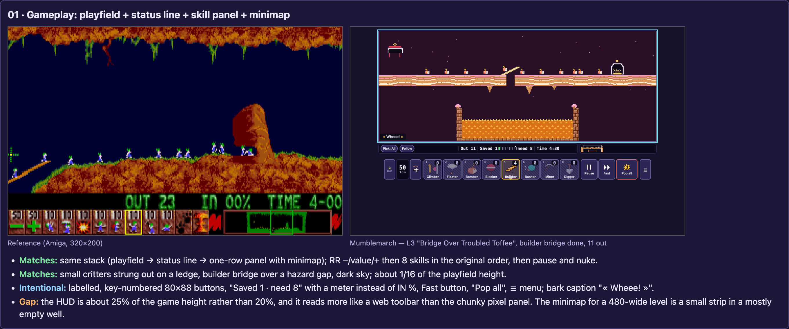
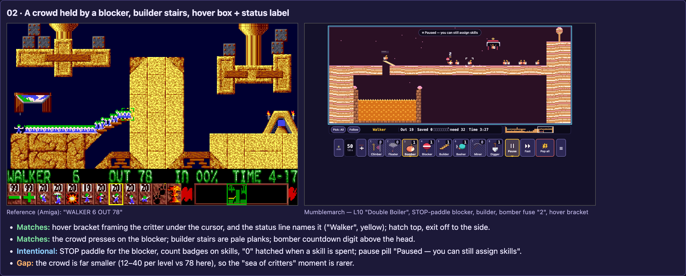
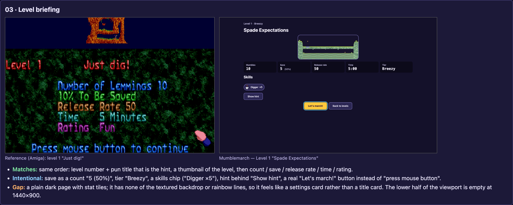
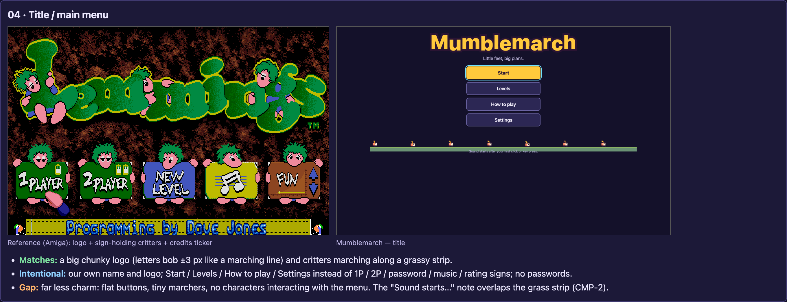
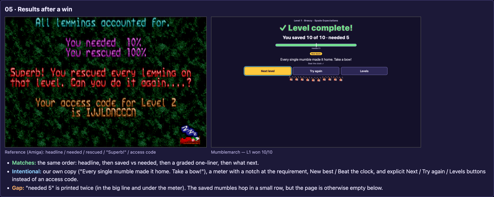
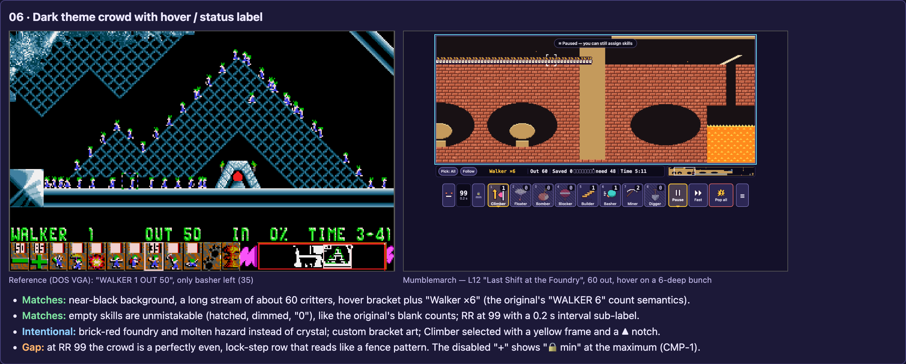

# T6 — Spirit & visual comparison vs the 1991 original

Tester: t6-compare · Build: pre-fix production snapshot on :5220 · Viewport 1440×900 (game scale ×3, DPR 2)
Side-by-side page: [`docs/testing/compare/index.html`](../compare/index.html) (served locally from `docs/` on :5230). Our raw captures are in `docs/testing/compare/ours/`.
How the scenes were staged: `__game.playSolution(id, {maxTicks})` to reach mid-level moments, then a minimap pointerdown to place the camera and a synthetic `pointermove` on `#game-canvas` for the hover. The results screen was reached with `navigate({screen:'results', …})` using the real `playSolution` outcome. The console showed 0 errors and 0 warnings.

## 01 · Gameplay panel

| Reference | Ours | Matches the spirit | Intentional differences | Gaps |
|---|---|---|---|---|
| Amiga dirt level: about 12 walkers, a builder bridge, `OUT 23 IN 00% TIME 4-00`, 12-button panel + minimap | L3 "Bridge Over Troubled Toffee" at tick ~500: 11 out, finished builder bridge over a toffee pit, Builder selected (4 left) | Same vertical stack: playfield → one status line → one row of buttons + minimap. Panel order is RR− · RR value · RR+ · Climber … Digger (the original order) · Pause · (Fast) · Pop all. Critters are ~10 world px in a 160 px world. Dark sky, a busy but calm stream. | Labelled 80×88 buttons with key digits and count badges. "Saved 1 ▰▱ need 8" instead of `IN %`. Fast-forward button. "Pop all" instead of the nuke art. ☰ menu. Bark caption "« Wheee! »". Our own sugarworks theme. | HUD ≈ 25% of the game block's height (the original is 20%). The panel reads as a modern web toolbar, not a pixel-art panel. On narrow levels the minimap is a small strip in a mostly empty 332 px well. At 1440×900, ~250 px below the toolbar stays empty (the scale rule caps at ×3 by width). |

## 02 · Busy builders / blocker crowd

| Reference | Ours | Matches the spirit | Intentional differences | Gaps |
|---|---|---|---|---|
| Amiga pillar level: a blocker holds ~78 lemmings before builder stairs, hover box, `WALKER 6` | L10 "Double Boiler" at tick 560, paused: STOP-paddle blocker, a builder laying planks, a bomber with fuse "2", ~7 walkers pressing on the blocker, hover bracket, status "Walker" | Hover bracket framing the critter under the cursor, with the status line naming it (yellow label in a fixed slot). Blocker/builder/bomber are each readable at a glance. The bomber countdown digit sits above the head. Hatch at the top, exit to the side. | STOP paddle (not the arms-out pose). Pale plank stairs. The pause pill "⏸ Paused — you can still assign skills" (pause-and-assign). Spent skills are hatched with "0". | Crowds are much smaller: our levels have 10–60 mumbles (most 12–20), so a "wall of 78 critters" moment rarely happens. |

## 03 · Level preview / briefing

| Reference | Ours | Matches the spirit | Intentional differences | Gaps |
|---|---|---|---|---|
| Amiga "Level 1 · Just dig!": thumbnail, five coloured stat lines, "Press mouse button to continue" | L1 "Spade Expectations" briefing | Same hierarchy: level number → pun title that is the hint → level thumbnail → count / save / release rate / time / rating. The level-1 title is the one-verb hint, as in the original. | Save as a count "5 (50%)". Tier "Breezy". A skills chip "Digger ×5". Hint behind "Show hint". A real "Let's march!" primary button + "Back to levels". No textured backdrop. | Visually it is a plain dark web card with stat tiles. It lacks the original's title-card flourish (texture, colour-coded lines), and the lower ~40% of the viewport is empty. |

## 04 · Title / menu

| Reference | Ours | Matches the spirit | Intentional differences | Gaps |
|---|---|---|---|---|
| Amiga logo with lemmings climbing on it, 5 signs held by lemmings, credits ticker | "Mumblemarch" logo, tagline "Little feet, big plans.", Start / Levels / How to play / Settings, marchers on a grass strip | A big chunky display logo whose letters bob ±3 px like a marching line. Critters march under the menu. | Our own name/logo (IP). No 2-player, no password/"new level" sign, no rating selector on the title (tiers live in Level select). | This is the weakest pair for charm. The original's menu *is* a gag (critters holding the signs); ours is flat buttons plus tiny 8 px marchers on a strip scaled by a non-integer 2.88. The sound note overlaps the grass band (**CMP-2**). |

## 05 · Results

| Reference | Ours | Matches the spirit | Intentional differences | Gaps |
|---|---|---|---|---|
| "All lemmings accounted for." / needed 10% / rescued 100% / "Superb!…" / access code | L1 won 10/10: "✓ Level complete!", "You saved 10 of 10 · needed 5", meter with a notch, "New best!", "Every single mumble made it home. Take a bow!", "Beat the clock ✓", Next level / Try again / Levels, saved mumbles hopping | Same order: headline → saved vs needed → graded one-liner → next action. The one-liner is graded by margin (e.g. "So close! Just {n} more needed.", "Bang on the number. Every mumble counted!", "Brilliant! You marched right past the target."). | Counts instead of %. A meter. Autosave instead of an access code. Explicit buttons. Kinder voice: no "ROCK BOTTOM!" sarcasm (DESIGN pillar 5: no mockery). | "needed 5" appears twice (in the big line and under the meter). The copy is warm but a touch less cheeky than the original. The hop row is small, and the page below is empty. |

## 06 · DOS VGA crowd + hover

| Reference | Ours | Matches the spirit | Intentional differences | Gaps |
|---|---|---|---|---|
| DOS crystal level on black: ~50 lemmings, hover box, `WALKER 1 OUT 50`, only the basher available (35), RR 50/85 | L12 "Last Shift at the Foundry" at tick 820: 60 out, near-black background, hover on a 6-deep bunch → "Walker ×6", RR 99 (0.2 s), Climber selected | A near-black background with a long stream of critters. The status label counts everything under the cursor ("Walker ×6", like `WALKER 6`). Empty skills are unmistakable (dimmed icon, hatch, "0"). The selected skill has a yellow frame (plus a ▲ notch). | Brick foundry and a molten hazard instead of crystal. Our bracket art. The RR interval sub-label "0.2 s". | At RR 99 the queue is a perfectly even lock-step row that reads as a fence pattern, less organic than the original's crowd. The disabled "+" shows "🔒 min" at the **maximum** (**CMP-1**). |

## Overall assessment (candid)

**Where it feels like *Lemmings*:**
- **Skill panel layout and order.** It follows the original exactly: RR −/+ around the value, 8 skills Climber → Digger in the classic order, then Pause and the nuke ("Pop all"), with the minimap on the status row. A veteran finds everything where their hand expects it; digit keys 1–8 map to the same order.
- **Tiny, readable critters against the playfield.** The critters keep the original scale (~1/16 of the 160 px world at ×3). The strong outline, the sprout tuft and the facing eye keep them readable on every theme we captured (mossgrove, sugarworks, foundry). Job props (STOP paddle, planks, fuse digit) read instantly.
- **Hover bracket + "what's under the cursor" label.** This is faithful in behaviour, including the count semantics ("Walker ×6").
- **Calm, then chaos.** The pacing is the original's: an empty level, then the hatch, then a trickle at RR 50, then bunching at blockers and hazards. With a crowd of 60 at RR 99 (L12) the pressure feels right. The pause pill makes the crisis manageable without removing it.
- **Humour and voice.** Pun titles do the original's "the title is the hint" job with our own jokes (Spade Expectations, Bridge Over Troubled Toffee, The Punch Line, Clam Before the Storm, Not One Step Bogward, Last Shift at the Foundry). Wordless-chirp barks are captioned "Off we go!" / "Uh-oh…" / "Wheee!". Graded verdicts vary by margin.
- **Flow.** Briefing → play → results mirrors the original's objective screen → level → completion screen, in the same information order, with autosave replacing access codes.

**What we deliberately changed (and why it is fine):**
- For IP, the name, logo, critter, skill icons, panel art, themes, sounds, music and all copy are original.
- Accessibility and usability:
  - full keyboard play (Z/X/[ ] selection, WASD cursor, digit skills);
  - **pause-and-assign** (the original forbade it);
  - frame-step, fast-forward and a relaxed timer;
  - captions for barks;
  - a high-contrast "clear physics" view and reduced motion;
  - counts instead of percentages;
  - a two-step Pop all instead of a double-click.

  These add controls (Fast, ☰, the Pick/Follow chips), but they don't break the "choose skill → choose critter" core.

**Real gaps against the original:**
1. **Charm on the menus.** The title, briefing and results are clean, accessible web screens. They lack the original's playful screen art: critters holding signs, textured title cards, the sleepy busy-pointer. In play the game feels like *Lemmings*; outside play it feels like a well-made web app. This is the biggest spirit gap.
2. **Scale of content.** There are 12 levels in 4 tiers (the original has 120) and crowds of 10–60 (the original has up to 80–100). The "sea of critters" set-pieces and the long mastery curve are necessarily thinner. There is no 2-player mode, no password/level-code culture, and no music/FX toggle sign on the title (sound lives in Settings).
3. **HUD weight.** The toolbar takes ~25% of the game block, versus 20% in the original. It is also visually heavier and more "UI-kit" than the original's compact pixel panel. It is legible, but the playfield is less dominant. At 1440×900 the game block leaves ~250 px of unused space, because the scale is capped by width.
4. **Crowd texture at high RR.** At RR 99 same-state walkers look like a regular row rather than a jostling crowd.
5. **Small visual defects:** **CMP-1** (the "+" shows "min" at 99) and **CMP-2** (the title note overlaps the strip and is low contrast; the strip scale is non-integer). There is also the "needed N" repetition on results (noted here, not filed).

**Could not verify:** audio character (chirps, music) and animation feel. Screenshots are stills, and other testers cover audio. Amiga-vs-DOS palette fidelity doesn't apply, since our palettes are original by design.
